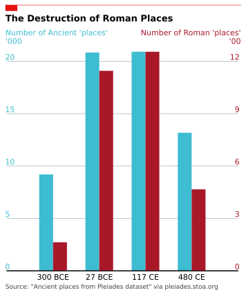

# The Rise and Fall of the Roman Empire

The Roman Empire has cemented itself in time as one of the greatest civilizations ever created. It’s history, full of conquest, great leaders, and eventual decline. 

The birth of the Roman Empire technically began in 27 BCE with Octavian, the adopted son of Julias Caesar, although the Roman Republic and Kingdom had been around since 753 BCE. Figure 1 shows how the Roman Republic/ Empire had already grown substantially by 27 BCE relative to the rest of the ancient world. This growth would continue as the Empire spread across most of western Europe and the Middle East until the height of the Empire was reached in 117 CE: shown in figure 2 by the combination of the blue and red dots. 

Peace and prosperity would continue for almost a century, but things would start to turn after the death of the well-respected Emperor Marcus Aurelius in 180 CE. Control of the Empire would change hands many times before the eventual collapse. By the ‘Crisis of the Third Century’, Roman legions had begun infighting, and the Empire was continually attacked.

With this decline, the ‘Fall of The Western Roman Empire’ eventually happened in 476 CE; this is often seen as the true end to the once great Roman Empire. Both figures show this demise; figure 1 shows how the relative number of Roman places had suffered massive decreases compared to the ancient places of that era. While figure 2 paints a more geographical image of this fall, showing in red Roman places that had been destroyed by 480 CE, many places survived but would have been lost to enemy tribes and Civilizations. 

The story of the Roman Empire is perhaps one of the greatest in human history and will surely not be forgotten.

